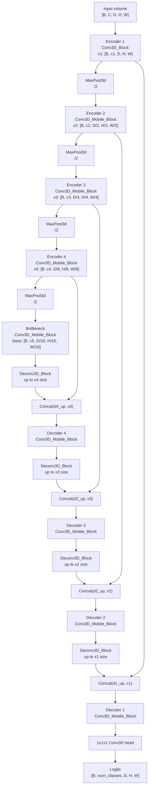

# Mobi Style 3D U-Net

This proposal is implemented in:

```text
baseline/Proposal/mobi_style_3D.py
```

The training entrypoint is:

```text
scripts/Proposal/train_mobi_style_3d.sh
```

which uses:

```text
config/Proposal/mobi_style_3d.yaml
```

## Current Model

`model_factory.py` resolves `model.name: mobi_style_3d` to:

```python
Proposal.mobi_style_3D.UNet3D_Mobile
```

The model expects:

```text
input:  [B, C, D, H, W]
output: [B, num_classes, D, H, W]
```

## Architecture

The current code follows a 5-level 3D U-Net style encoder-decoder:

```text
volume
  -> Conv3D_Block
  -> MaxPool3d
  -> Conv3D_Mobile_Block
  -> MaxPool3d
  -> Conv3D_Mobile_Block
  -> MaxPool3d
  -> Conv3D_Mobile_Block
  -> MaxPool3d
  -> Conv3D_Mobile_Block bottleneck
  -> 3D decoder with same-scale skip fusion
  -> 1x1x1 segmentation head
```

### Architecture Diagram



Text version:

```text
Input [B, C, D, H, W]
  |
  |-- x1 = Conv3D_Block
  |       shape: [B, c1, D, H, W]
  |
  |-- x2 = MaxPool3d(x1) -> Conv3D_Mobile_Block
  |       shape: [B, c2, D/2, H/2, W/2]
  |
  |-- x3 = MaxPool3d(x2) -> Conv3D_Mobile_Block
  |       shape: [B, c3, D/4, H/4, W/4]
  |
  |-- x4 = MaxPool3d(x3) -> Conv3D_Mobile_Block
  |       shape: [B, c4, D/8, H/8, W/8]
  |
  |-- base = MaxPool3d(x4) -> Conv3D_Mobile_Block
  |       shape: [B, c5, D/16, H/16, W/16]
  |
  |-- d4 = Conv3D_Mobile_Block(concat(up(base), x4))
  |-- d3 = Conv3D_Mobile_Block(concat(up(d4), x3))
  |-- d2 = Conv3D_Mobile_Block(concat(up(d3), x2))
  |-- d1 = Conv3D_Mobile_Block(concat(up(d2), x1))
  |
  |-- logits = 1x1x1 Conv3D(d1)
      shape: [B, num_classes, D, H, W]
```

`Conv3D_Mobile_Block` uses:

```text
1x1x1 Conv3D expansion
3x3x3 depthwise Conv3D
1x1x1 pointwise Conv3D projection
optional residual projection
```

## Shape Handling

The decoder only concatenates tensors at the same skip scale:

```text
d4 = cat(up(base), x4)
d3 = cat(up(d4), x3)
d2 = cat(up(d3), x2)
d1 = cat(up(d2), x1)
```

Before every concat, `_match_spatial_3d(...)` resizes the upsampled tensor to
the skip tensor spatial size. The final logits are also matched back to the
input volume size.

This keeps output and target compatible even for odd input sizes.

## Config

The base config uses:

```yaml
model:
  name: mobi_style_3d
  type: 3D
  args_3d:
    feature_channels: [16, 32, 64, 128]
    residual: conv
```

Four `feature_channels` values are accepted. The model appends the bottleneck
channel internally, so:

```text
[16, 32, 64, 128] -> [16, 32, 64, 128, 256]
```

## Verified Shapes

Smoke tests currently pass:

```text
(1, 1, 16, 64, 64) -> (1, 2, 16, 64, 64)
(1, 1, 15, 63, 65) -> (1, 2, 15, 63, 65)
(1, 1, 5, 31, 33)  -> (1, 2, 5, 31, 33)
```
