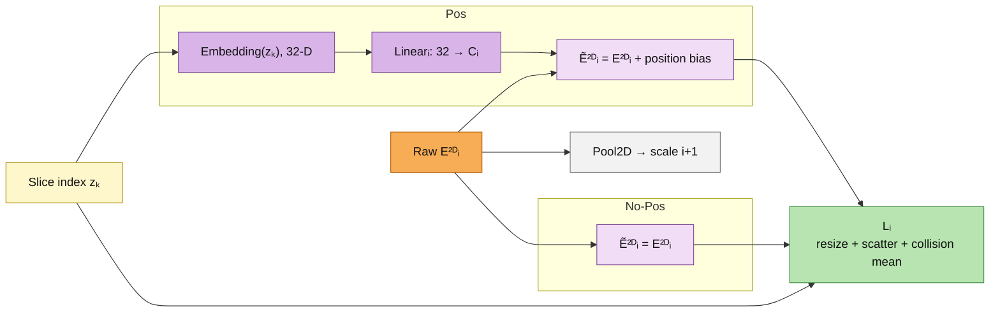
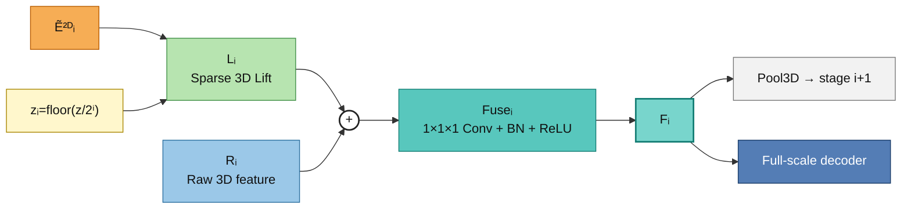

# Proposal-Guided Hybrid 2D–3D UNet 3+

Kiến trúc được cố định cho thí nghiệm:

- **2D encoder:** `UNet3Plus2DEncoder`
- **3D encoder:** `UNet3Plus3DEncoder`
- **3D decoder:** `UNet3Plus3DDecoder` (`full_scale`)
- **Slice selection:** `proposal`
- **Encoder fusion:** `add`
- **Variants:** `Pos` và `No-Pos`

Implementation chính: [`HybridModel/hybrid_base.py`](./HybridModel/hybrid_base.py).

## 1. Block diagram tổng thể

```mermaid
flowchart LR
    X["Input volume X<br/>B×1×D×H×W"]:::input

    subgraph SELECT["Proposal selection"]
        direction LR
        PS["Proposal Selector<br/>15 groups · MAD"]:::proposal
        S["15 selected 2D slices"]:::proposal
        Z(["Slice indices z"]):::index
        PS --> S
        PS --> Z
    end

    X --> PS

    subgraph E2D["UNet 3+ 2D Encoder — raw feature pathway"]
        direction LR
        E1["E²ᴰ₁<br/>2×Conv2D · 16"]:::enc2d
        P21["Pool2D"]:::pool
        E2["E²ᴰ₂<br/>2×Conv2D · 32"]:::enc2d
        P22["Pool2D"]:::pool
        E3["E²ᴰ₃<br/>2×Conv2D · 64"]:::enc2d
        P23["Pool2D"]:::pool
        E4["E²ᴰ₄<br/>2×Conv2D · 128"]:::enc2d
        P24["Pool2D"]:::pool
        E5["E²ᴰ₅<br/>2×Conv2D · 256"]:::enc2d
        E1 --> P21 --> E2 --> P22 --> E3 --> P23 --> E4 --> P24 --> E5
    end

    S --> E1

    PE["Position Embedding<br/>dim=32"]:::pos
    Z --> PE

    M1["Mode₁<br/>No-Pos: E²ᴰ₁<br/>Pos: E²ᴰ₁ + Linear₁(PE)"]:::mode
    M2["Mode₂<br/>No-Pos: E²ᴰ₂<br/>Pos: E²ᴰ₂ + Linear₂(PE)"]:::mode
    M3["Mode₃<br/>No-Pos: E²ᴰ₃<br/>Pos: E²ᴰ₃ + Linear₃(PE)"]:::mode
    M4["Mode₄<br/>No-Pos: E²ᴰ₄<br/>Pos: E²ᴰ₄ + Linear₄(PE)"]:::mode
    M5["Mode₅<br/>No-Pos: E²ᴰ₅<br/>Pos: E²ᴰ₅ + Linear₅(PE)"]:::mode

    E1 --> M1
    E2 --> M2
    E3 --> M3
    E4 --> M4
    E5 --> M5
    PE -.-> M1
    PE -.-> M2
    PE -.-> M3
    PE -.-> M4
    PE -.-> M5

    ZS["Scaled indices<br/>zᵢ=floor(z/2ⁱ)"]:::index
    Z --> ZS

    L1["L₁<br/>Sparse 2D→3D Lift"]:::lift
    L2["L₂<br/>Sparse 2D→3D Lift"]:::lift
    L3["L₃<br/>Sparse 2D→3D Lift"]:::lift
    L4["L₄<br/>Sparse 2D→3D Lift"]:::lift
    L5["L₅<br/>Sparse 2D→3D Lift"]:::lift

    M1 --> L1
    M2 --> L2
    M3 --> L3
    M4 --> L4
    M5 --> L5
    ZS -.-> L1
    ZS -.-> L2
    ZS -.-> L3
    ZS -.-> L4
    ZS -.-> L5

    subgraph E3D["UNet 3+ 3D Encoder — progressive additive fusion"]
        direction LR
        R1["R₁<br/>2×Conv3D · 16"]:::enc3d
        A1(("+")):::add
        U1["Fuse₁"]:::fuse
        F1["F₁"]:::fused
        P31["Pool3D"]:::pool

        R2["R₂<br/>2×Conv3D · 32"]:::enc3d
        A2(("+")):::add
        U2["Fuse₂"]:::fuse
        F2["F₂"]:::fused
        P32["Pool3D"]:::pool

        R3["R₃<br/>2×Conv3D · 64"]:::enc3d
        A3(("+")):::add
        U3["Fuse₃"]:::fuse
        F3["F₃"]:::fused
        P33["Pool3D"]:::pool

        R4["R₄<br/>2×Conv3D · 128"]:::enc3d
        A4(("+")):::add
        U4["Fuse₄"]:::fuse
        F4["F₄"]:::fused
        P34["Pool3D"]:::pool

        R5["R₅<br/>2×Conv3D · 256"]:::enc3d
        A5(("+")):::add
        U5["Fuse₅"]:::fuse
        F5["F₅"]:::fused

        R1 --> A1 --> U1 --> F1 --> P31 --> R2
        R2 --> A2 --> U2 --> F2 --> P32 --> R3
        R3 --> A3 --> U3 --> F3 --> P33 --> R4
        R4 --> A4 --> U4 --> F4 --> P34 --> R5
        R5 --> A5 --> U5 --> F5
    end

    X --> R1
    L1 --> A1
    L2 --> A2
    L3 --> A3
    L4 --> A4
    L5 --> A5

    BUS["Full-scale skip bus<br/>F₁ · F₂ · F₃ · F₄ · F₅"]:::bus
    F1 --> BUS
    F2 --> BUS
    F3 --> BUS
    F4 --> BUS
    F5 --> BUS

    subgraph DEC["UNet 3+ 3D Full-Scale Decoder"]
        direction LR
        D4["D₄"]:::decoder
        D3["D₃"]:::decoder
        D2["D₂"]:::decoder
        D1["D₁"]:::decoder
        D4 --> D3 --> D2 --> D1
    end

    BUS --> D4
    BUS --> D3
    BUS --> D2
    BUS --> D1

    H["1×1×1 Conv3D"]:::head
    Y["Segmentation Ŷ<br/>B×2×D×H×W"]:::output
    D1 --> H --> Y

    classDef input fill:#eeeeee,stroke:#333333,color:#111111,stroke-width:2px;
    classDef proposal fill:#f6d7a7,stroke:#b7791f,color:#111111;
    classDef index fill:#fff7cc,stroke:#a88600,color:#111111;
    classDef enc2d fill:#f6ad55,stroke:#b85c00,color:#111111;
    classDef pos fill:#d8b4e8,stroke:#805099,color:#111111;
    classDef mode fill:#f2ddf7,stroke:#805099,color:#111111;
    classDef lift fill:#b7e4b0,stroke:#3f8f45,color:#111111;
    classDef enc3d fill:#9bc8e8,stroke:#2b6f9f,color:#111111;
    classDef add fill:#ffffff,stroke:#222222,color:#111111,stroke-width:2px;
    classDef fuse fill:#58c7bd,stroke:#147d74,color:#111111;
    classDef fused fill:#78d5cc,stroke:#147d74,color:#111111,stroke-width:2px;
    classDef pool fill:#f2f2f2,stroke:#777777,color:#111111;
    classDef bus fill:#b7c9e8,stroke:#244d84,color:#111111,stroke-width:2px;
    classDef decoder fill:#547db5,stroke:#183b68,color:#ffffff;
    classDef head fill:#ef8b82,stroke:#a52a2a,color:#111111;
    classDef output fill:#d9534f,stroke:#8b1a1a,color:#ffffff,stroke-width:2px;
```



## 2. Pos và No-Pos tại mỗi scale



Điểm quan trọng:

- `E²ᴰᵢ` raw tiếp tục qua `Pool2D` để tạo scale kế tiếp.
- **Pos** chỉ được cộng vào feature output dùng cho `Liftᵢ`; feature đã cộng Pos không quay lại encoder 2D.
- **No-Pos** không cộng embedding nhưng vẫn dùng `z` để scatter feature vào chiều sâu.
- Cả Pos và No-Pos đều inject feature 2D tại đủ năm scale.

## 3. Một hybrid stage



Với channel hai encoder bằng nhau, feature fusion tại scale `i` là:

\[
F_i=\operatorname{ReLU}\left(
\operatorname{BN}\left(
\operatorname{Conv}_{1\times1\times1}(R_i+L_i)
\right)\right)
\]

`F₁…F₄` đi qua `Pool3D` để tạo input cho stage 3D tiếp theo; `F₁…F₅` đồng thời được gửi tới decoder. Không có `Pool3D` sau `F₅`.

## 4. UNet 3+ full-scale decoder

Tại mỗi decoder stage `Dᵢ`:

1. Resize cả năm fused encoder features `F₁…F₅` về target scale.
2. Chiếu từng feature bằng Conv3D `1×1×1`.
3. Resize và chiếu các decoder feature thô hơn đã có.
4. Concatenate tất cả feature.
5. Áp dụng hai Conv3D `3×3×3 + BN + ReLU`.

Decoder cuối cùng dùng Conv3D `1×1×1` để sinh logits segmentation.

## 5. Cấu hình kiến trúc

```yaml
model:
  encoder_2d:
    type: unet3plus
    channels: [16, 32, 64, 128, 256]

  encoder_3d:
    type: unet3plus3d
    channels: [16, 32, 64, 128, 256]

  decoder:
    model: unet3plus3d
    style: full_scale
    deep_supervision: false

  slice_selection:
    mode: proposal
    num_slices: 15
    proposal:
      num_groups: 15
      samples_per_group: 1
      similarity_metric: mad

  position_encoder:
    enabled: true       # Pos
    # enabled: false    # No-Pos
    embedding_dim: 32
    max_positions: 512

  fusion:
    type: add
```

## 6. Ánh xạ tới code

- `UNet3Plus2DEncoder`: [`2D_encoder/Unet3Plus2D.py`](./2D_encoder/Unet3Plus2D.py)
- `UNet3Plus3DEncoder`: [`3D_encoder/UNet3Plus3D.py`](./3D_encoder/UNet3Plus3D.py)
- `UNet3Plus3DDecoder`: [`Decoder/decoder_3_plus_style.py`](./Decoder/decoder_3_plus_style.py)
- Pos/No-Pos, lifting và fusion: [`HybridModel/hybrid_base.py`](./HybridModel/hybrid_base.py)
- Proposal selection: [`selection_slice_2D.py`](./selection_slice_2D.py)

> Trong implementation hiện tại, các class encoder `UNet3Plus2DEncoder` và `UNet3Plus3DEncoder` kế thừa encoder UNet năm tầng. Đặc trưng full-scale dense của UNet 3+ được thực hiện trong `UNet3Plus3DDecoder`.
